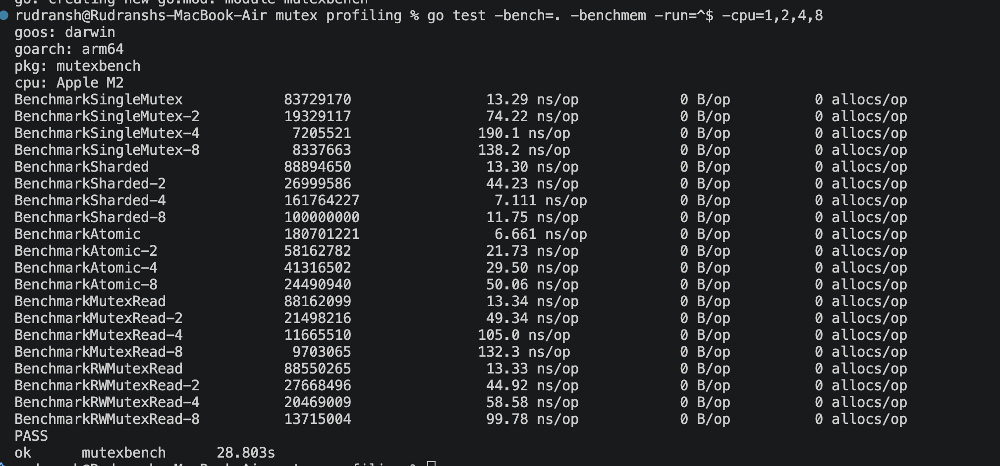
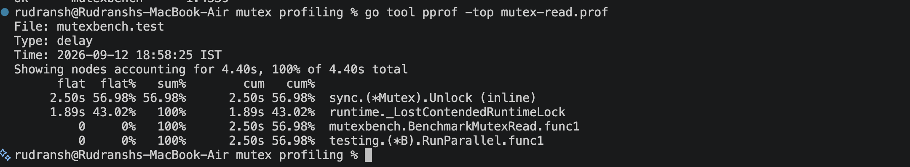
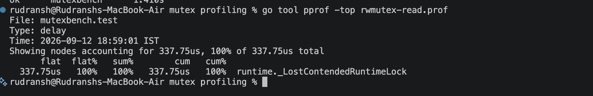
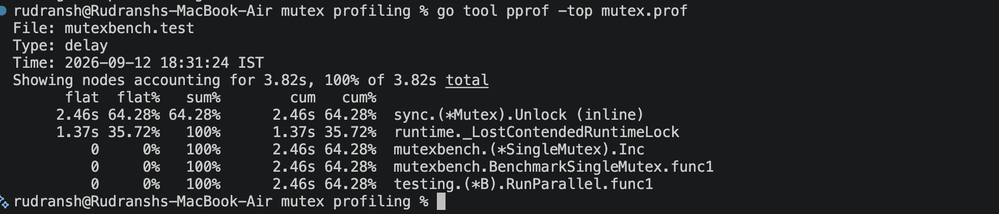
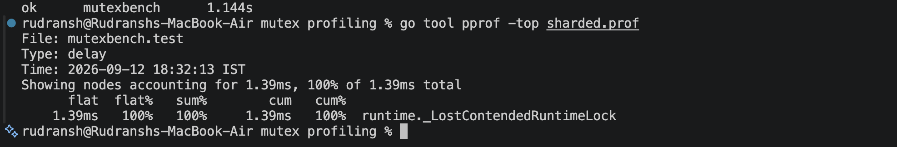

# Go Mutex Contention, Sharding, Atomics & Mutex Profiling


## 1. What this project demonstrates

The benchmark compares four synchronization strategies/workloads:

  -----------------------------------------------------------------------
  Benchmark                           What it demonstrates
  ----------------------------------- -----------------------------------
  `BenchmarkSingleMutex`              One mutex protecting one shared
                                      counter

  `BenchmarkSharded`                  16 independently locked shards

  `BenchmarkAtomic`                   Atomic increment without a mutex

  `BenchmarkMutexRead`                Multiple readers serialized by
                                      `sync.Mutex`

  `BenchmarkRWMutexRead`              Multiple readers using
                                      `sync.RWMutex.RLock()`
  -----------------------------------------------------------------------

The central question is:

> What happens when more goroutines/parallel workers compete for the
> same shared state?

The experiment shows that more concurrency does **not automatically mean
more throughput**. If concurrency creates contention around a single
shared resource, the additional workers can spend more time waiting than
doing useful work.

------------------------------------------------------------------------


# 3. Benchmark implementations

## 3.1 Single mutex

``` go
type SingleMutex struct {
    mu    sync.Mutex
    count int64
}

func (c *SingleMutex) Inc() {
    c.mu.Lock()
    c.count++
    c.mu.Unlock()
}
```

There is one lock protecting one counter.

Conceptually:

``` text
G1 ──┐
G2 ──┤
G3 ──┤
G4 ──┤──> ONE MUTEX ──> count
G5 ──┤
G6 ──┘
```

Only one goroutine can enter the critical section at a time.

As the number of competing workers increases, more workers can spend
time waiting for the same mutex.

------------------------------------------------------------------------

## 3.2 Sharded mutexes

``` go
const numShards = 16
```

The counter is split into 16 independently locked shards.

Conceptually:

``` text
Shard 0  → Lock 0 → Count 0
Shard 1  → Lock 1 → Count 1
Shard 2  → Lock 2 → Count 2
...
Shard 15 → Lock 15 → Count 15
```

Instead of:

``` text
8 workers → 1 lock
```

we can have:

``` text
8 workers → distributed across 16 locks
```

Only workers landing on the same shard need to contend with one another.

### Why shard?

Sharding reduces the size of each contention domain.

The trade-off is that the application now has multiple counters/state
buckets rather than one globally protected value. If a global total is
required, the shards may need to be aggregated.

------------------------------------------------------------------------

## 3.3 Atomic counter

``` go
type Atomic struct {
    count int64
}

func (c *Atomic) Inc() {
    atomic.AddInt64(&c.count, 1)
}
```

There is no mutex.

The increment is performed atomically.

For a simple operation such as incrementing an integer counter, an
atomic operation can have considerably lower overhead than acquiring and
releasing a mutex.

However, atomics are **not contention-free**.

All workers still modify the same memory location, so cache-coherence
traffic can become a bottleneck as concurrency increases.

------------------------------------------------------------------------

# 4. Cache-line padding

The sharded structure contains:

``` go
_ [40]byte
```

The purpose is to separate adjacent shards so that frequently modified
shard state is less likely to share a cache line.

A CPU typically moves memory between cache levels in cache-line-sized
units.

If two CPUs modify different variables that happen to live on the same
cache line, the cache line can repeatedly move between CPU caches.

This is called **false sharing**.

Conceptually:

``` text
Without padding:

┌──────────────────────────────────────┐
│ shard0 │ shard1 │ shard2 │ ...       │
└──────────────────────────────────────┘
       ↑        ↑
      CPU 1    CPU 2

Different variables,
same cache line.
```

With padding:

``` text
┌──────────────────────┐
│ shard 0 + padding    │
└──────────────────────┘

┌──────────────────────┐
│ shard 1 + padding    │
└──────────────────────┘
```

The exact amount of padding should be treated as architecture/cache-line
dependent. The benchmark uses padding to demonstrate the principle
rather than to claim that `[40]byte` is a universal cache-line layout.

------------------------------------------------------------------------

# 5. Running the benchmark

## 5.1 Run all benchmarks

``` bash
go test -bench=. -benchmem -run=^$ -cpu=1,2,4,8
```

### Meaning of the flags

``` text
-bench=.
```

Run all benchmark functions.

``` text
-benchmem
```

Report allocations and allocated bytes.

``` text
-run=^$
```

Run no ordinary tests. `^$` matches an empty test name.

``` text
-cpu=1,2,4,8
```

Run each benchmark with different `GOMAXPROCS` values.

Important:

> `-cpu=8` does not mean the benchmark creates exactly 8 goroutines. It
> sets the maximum number of CPUs that Go's scheduler can execute Go
> code on. `b.RunParallel` then distributes benchmark work across
> parallel workers.

------------------------------------------------------------------------

# 6. My benchmark environment

The benchmark was executed on:

``` text
OS:       darwin
Architecture: arm64
CPU:      Apple M2
```

This matters because benchmark numbers are hardware- and
workload-dependent.

Do not copy the exact nanosecond values and assume they will be
identical on another machine.

The important thing is the behavior and scaling pattern.

------------------------------------------------------------------------

# 7. Benchmark results

The actual benchmark produced:

``` text
BenchmarkSingleMutex
13.29 ns/op

BenchmarkSingleMutex-2
74.22 ns/op

BenchmarkSingleMutex-4
190.1 ns/op

BenchmarkSingleMutex-8
138.2 ns/op
```

``` text
BenchmarkSharded
13.30 ns/op

BenchmarkSharded-2
44.23 ns/op

BenchmarkSharded-4
7.111 ns/op

BenchmarkSharded-8
11.75 ns/op
```

``` text
BenchmarkAtomic
6.661 ns/op

BenchmarkAtomic-2
21.73 ns/op

BenchmarkAtomic-4
29.50 ns/op

BenchmarkAtomic-8
50.06 ns/op
```

``` text
BenchmarkMutexRead
13.34 ns/op

BenchmarkMutexRead-2
49.34 ns/op

BenchmarkMutexRead-4
105.0 ns/op

BenchmarkMutexRead-8
132.3 ns/op
```

``` text
BenchmarkRWMutexRead
13.33 ns/op

BenchmarkRWMutexRead-2
44.92 ns/op

BenchmarkRWMutexRead-4
58.58 ns/op

BenchmarkRWMutexRead-8
99.78 ns/op
```

All benchmarks reported:

``` text
0 B/op
0 allocs/op
```

So the benchmark did not introduce heap allocations per operation.

------------------------------------------------------------------------

# 8. Benchmark screenshot

<p align="center">
  
</p>

------------------------------------------------------------------------

# 9. Reading the benchmark results

## Single mutex

My results were:

    Parallelism   ns/op
              1   13.29
              2   74.22
              4   190.1
              8   138.2

The major observation is the increase from:

``` text
13.29 ns
```

at one CPU to:

``` text
74.22 ns
190.1 ns
138.2 ns
```

with more parallelism.

The reason is that every worker is trying to acquire the same mutex.

``` text
Worker 1 ──┐
Worker 2 ──┤
Worker 3 ──┤──> ONE LOCK
Worker 4 ──┤
Worker 5 ──┘
```

The 4-CPU result is higher than the 8-CPU result in this particular run.
That does not invalidate the result. Microbenchmarks contain scheduling,
CPU-frequency, cache, and runtime noise.

The important observation is that contention becomes dramatically more
expensive than the uncontended one-worker case.

------------------------------------------------------------------------

# 10. Sharded results

My results were:

    Parallelism   ns/op
         1        13.30
         2        44.23
         4         7.111
         8         11.75

Compared with the single mutex, the sharded implementation avoids making
every worker compete for exactly one lock.

At 4 workers in this particular run:

``` text
SingleMutex = 190.1 ns/op
Sharded     = 7.111 ns/op
```

This illustrates the benefit of distributing contention.

The exact values are not guaranteed to reproduce on another run or
machine.

------------------------------------------------------------------------

# 11. Atomic results

My results were:

    Parallelism   ns/op
              1   6.661
              2   21.73
              4   29.50
              8   50.06

Atomic is the fastest at one worker:

``` text
Atomic = 6.661 ns/op
```

But an important result is that atomic does **not** stay flat as
concurrency increases.

At 8 workers:

``` text
Atomic = 50.06 ns/op
```

Why?

Because every worker is still modifying the same memory location:

``` text
G1 ──┐
G2 ──┤
G3 ──┤──> same counter
G4 ──┤
G5 ──┘
```

The mutex has been removed, but hardware cache-coherence traffic
remains.

This gives an important performance lesson:

> Removing a mutex does not automatically remove all forms of
> contention.

------------------------------------------------------------------------

# 12. Mutex vs RWMutex

The read benchmarks were:

    Parallelism      Mutex    RWMutex
              1   13.34 ns   13.33 ns
              2   49.34 ns   44.92 ns
              4   105.0 ns   58.58 ns
              8   132.3 ns   99.78 ns

The workload only reads:

``` go
_ = value
```

With `sync.Mutex`:

``` go
mu.Lock()
_ = value
mu.Unlock()
```

Only one reader enters at a time.

With `sync.RWMutex`:

``` go
mu.RLock()
_ = value
mu.RUnlock()
```

Multiple readers can hold the read lock concurrently.

Conceptually:

``` text
sync.Mutex

Reader 1 → LOCK → READ → UNLOCK
Reader 2 → WAIT
Reader 3 → WAIT
Reader 4 → WAIT
```

versus:

``` text
sync.RWMutex

Reader 1 → RLock ─┐
Reader 2 → RLock ─┤
Reader 3 → RLock ─┤→ READ
Reader 4 → RLock ─┘
```

This is why the RWMutex benchmark performs better for this read-only
workload.

It does **not** mean `RWMutex` should always replace `Mutex`.

<p align="center">
  
</p>

<p align="center">
  
</p>


------------------------------------------------------------------------

# 13. Mutex profiling

Benchmarking tells us:

> How fast is it?

Profiling tells us:

> Where is the contention coming from?

Run:

``` bash
go test -bench=BenchmarkSingleMutex -run=^$ -cpu=8 -mutexprofile=mutex.prof
```

Then:

``` bash
go tool pprof -top mutex.prof
```

------------------------------------------------------------------------

# 14. Single mutex profile result

The profile from the Apple M2 run reported:

``` text
Showing nodes accounting for 3.82s, 100% of 3.82s total

2.46s  64.28%  sync.(*Mutex).Unlock (inline)
1.37s  35.72%  runtime._LostContendedRuntimeLock
```

The important result is:

``` text
sync.(*Mutex).Unlock → 64.28%
runtime._LostContendedRuntimeLock → 35.72%
```

This does **not** mean that `Unlock()` itself is taking 2.46 seconds.

Go's mutex contention profile attributes contention to the call path of
the goroutine holding/releasing the mutex.

Therefore, the useful question is:

> What critical section is associated with this mutex?

The profiler is helping identify the code responsible for making other
goroutines wait.

<p align="center">
  
</p>

------------------------------------------------------------------------

# 15. Sharded mutex profile

The sharded benchmark profile reported:

``` text
Showing nodes accounting for 1.39ms, 100% of 1.39ms total

1.39ms  100%  runtime._LostContendedRuntimeLock
```

Compared with the single-mutex profile:

``` text
Single mutex:
3.82 seconds of contention delay

Sharded:
1.39 milliseconds
```

That is a dramatic reduction in measured mutex contention for this
particular benchmark run.

This is exactly what we would expect if sharding successfully
distributes workers across independent locks.

Again, this is a benchmark result, not a universal production guarantee.

<p align="center">
  
</p>

------------------------------------------------------------------------

# 16. Mutex read profile

The `sync.Mutex` read benchmark produced:

``` text
Showing nodes accounting for 4.40s, 100% of 4.40s total

2.50s  56.98%  sync.(*Mutex).Unlock (inline)
1.89s  43.02%  runtime._LostContendedRuntimeLock
```

This makes sense because every reader has to acquire the same exclusive
mutex.

Even though the operation only reads:

``` go
_ = value
```

readers are still serialized.

------------------------------------------------------------------------

# 20. Mutex-read profile screenshot

Paste the URL of the screenshot here:

**Mutex read pprof screenshot:**
`PASTE_MUTEX_READ_PROFILE_SCREENSHOT_LINK_HERE`

------------------------------------------------------------------------

# 21. RWMutex read profile

The `RWMutex` read benchmark produced:

``` text
Showing nodes accounting for 337.75us, 100% of 337.75us total

337.75us  100%  runtime._LostContendedRuntimeLock
```

The measured contention is dramatically smaller than the normal mutex
read benchmark in this run.

The reason is that readers can share the read lock.

------------------------------------------------------------------------

# 22. RWMutex profile screenshot

Paste the URL of the screenshot here:

**RWMutex read pprof screenshot:**
`PASTE_RWMUTEX_READ_PROFILE_LINK_HERE`

------------------------------------------------------------------------

# 23. Comparing the profiles

Your four profiles demonstrate an important pattern:

  Workload         Profile total Main observation
  -------------- --------------- -----------------------------------------
  Single Mutex            3.82 s Significant contention around one mutex
  Sharded                1.39 ms Much less lock contention
  Mutex Read              4.40 s Readers serialize behind one mutex
  RWMutex Read         337.75 µs Concurrent readers reduce contention

These numbers should not be interpreted as universal performance ratios
because each profile is a separate benchmark run and profile duration
depends on how long the benchmark executes.

The important result is the **qualitative difference in contention**.

------------------------------------------------------------------------

# 24. Why does the profiler show `runtime._LostContendedRuntimeLock`?

This runtime entry represents time associated with contended runtime
locking that could not be attributed more specifically in the profile.

It is not a function in your application that you should directly
optimize.

For application-level diagnosis, focus on:

1.  Which application operation is contended?
2.  Which mutex protects it?
3.  How long is the mutex held?
4.  What work is being performed while holding it?
5.  Can the critical section be reduced?
6.  Can the state be sharded?
7.  Can the state use an atomic operation instead?
8.  Is false sharing making independent data fight over cache lines?

------------------------------------------------------------------------

# 25. The critical section is the real target

Suppose production code looks like:

``` go
mu.Lock()

queryDatabase()
calculateSomething()
callAnotherService()
updateSharedState()

mu.Unlock()
```

The problem is not necessarily:

``` go
mu.Lock()
```

The real problem may be:

``` text
                LOCK
                  │
                  ▼
        ┌───────────────────┐
        │ Database query     │
        │ Calculation        │
        │ Network call       │
        │ Cache operation    │
        └───────────────────┘
                  │
                  ▼
               UNLOCK
```

The lock is held while expensive work happens.

A better design may be:

``` go
data := queryDatabase()
result := calculateSomething(data)

mu.Lock()
updateSharedState(result)
mu.Unlock()
```

Now the critical section is much smaller.

------------------------------------------------------------------------

# 26. A practical contention-debugging workflow

When a production Go service is slow because of synchronization:

``` text
1. Observe latency / throughput problem
             ↓
2. Benchmark the suspected workload
             ↓
3. Measure scaling at different GOMAXPROCS levels
             ↓
4. Capture a mutex profile
             ↓
5. Run pprof
             ↓
6. Find the contended call path
             ↓
7. Inspect the critical section
             ↓
8. Reduce lock hold time
             ↓
9. Consider sharding
             ↓
10. Consider atomics for simple state
             ↓
11. Consider RWMutex for genuinely read-heavy workloads
             ↓
12. Consider cache locality / false sharing
             ↓
13. Benchmark again
```

This is much better than blindly replacing synchronization primitives.

------------------------------------------------------------------------

# 27. Commands cheat sheet

## Run all benchmarks

``` bash
go test -bench=. -benchmem -run=^$ -cpu=1,2,4,8
```

## Profile single mutex

``` bash
go test -bench=BenchmarkSingleMutex -run=^$ -cpu=8 -mutexprofile=mutex.prof
```

``` bash
go tool pprof -top mutex.prof
```

## Profile sharded mutex

``` bash
go test -bench=BenchmarkSharded -run=^$ -cpu=8 -mutexprofile=sharded.prof
```

``` bash
go tool pprof -top sharded.prof
```

## Profile normal mutex reads

``` bash
go test -bench=BenchmarkMutexRead -run=^$ -cpu=8 -mutexprofile=mutex-read.prof
```

``` bash
go tool pprof -top mutex-read.prof
```

## Profile RWMutex reads

``` bash
go test -bench=BenchmarkRWMutexRead -run=^$ -cpu=8 -mutexprofile=rwmutex-read.prof
```

``` bash
go tool pprof -top rwmutex-read.prof
```

------------------------------------------------------------------------

# 28. Key takeaways

### Takeaway 1 --- More concurrency can hurt

``` text
More workers
     ↓
More contenders
     ↓
More waiting
     ↓
Less useful work
```

------------------------------------------------------------------------

### Takeaway 2 --- A single mutex can become a bottleneck

``` text
Many goroutines
       ↓
   ONE LOCK
       ↓
 serialization
```

------------------------------------------------------------------------

### Takeaway 3 --- Sharding reduces contention

``` text
ONE lock
   ↓
16 independent locks
   ↓
smaller contention domains
```

------------------------------------------------------------------------

### Takeaway 4 --- Atomics are not magic

An atomic counter removes mutex overhead:

``` go
atomic.AddInt64(...)
```

but many CPUs can still contend over the same memory location and cache
line.

------------------------------------------------------------------------

### Takeaway 5 --- RWMutex is useful for appropriate read-heavy workloads

``` text
Many readers
    ↓
RLock()
    ↓
read concurrently
```

But it is not automatically better than `sync.Mutex`.

------------------------------------------------------------------------

### Takeaway 6 --- Cache layout matters

Even independently locked shards can suffer if frequently modified data
shares cache lines.

That leads directly into:

``` text
Cache lines
     ↓
False sharing
     ↓
Padding
     ↓
Data locality
     ↓
Struct layout
     ↓
Alignment
```

------------------------------------------------------------------------

### Takeaway 7 --- Profile instead of guessing

Don't ask:

> "Which lock do I think is slow?"

Ask:

> "Which critical section is creating contention?"

Use:

``` bash
go test ... -mutexprofile=mutex.prof
```

and:

``` bash
go tool pprof -top mutex.prof
```

------------------------------------------------------------------------

# 29. Final experiment summary

This small benchmark demonstrates a progression from software-level
synchronization to hardware-level effects:

``` text
                    Shared state
                         │
                         ▼
                   One Mutex
                         │
                         ▼
                Lock contention
                         │
                         ▼
                     Sharding
                         │
                         ▼
              Less lock contention
                         │
                         ▼
                  Cache locality
                         │
                         ▼
                   False sharing
                         │
                         ▼
                     Padding
                         │
                         ▼
             Better memory behavior
```

The most important performance-engineering principle is:

> **Measure first, identify the actual bottleneck, make the smallest
> targeted change, and benchmark again.**

------------------------------------------------------------------------

# 30. Screenshots / evidence

Replace the placeholders above with your uploaded screenshots or hosted
image links.

Suggested order:

1.  Benchmark results
2.  Single mutex profile
3.  Sharded profile
4.  Mutex-read profile
5.  RWMutex-read profile

This makes the README easy to verify: first show the benchmark numbers,
then show the profiling evidence explaining the contention.
